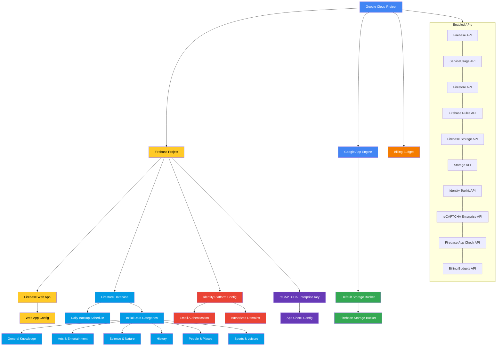

# Infrastructure Diagram

Based on the Terraform [infrastructure](/infrastructure/) files.

```mermaid
flowchart TD
  %% Main project setup
  GCP["Google Cloud Project"] --> FBP["Firebase Project"]
  GCP --> GAE["Google App Engine"]

  %% Firebase Web App
  FBP --> WebApp["Firebase Web App"]
  WebApp --> AppConfig["Web App Config"]

  %% Firestore
  FBP --> Firestore["Firestore Database"]
  Firestore --> BackupSchedule["Daily Backup Schedule"]
  Firestore --> Categories["Initial Data Categories"]
  Categories --> Cat1["General Knowledge"]
  Categories --> Cat2["Arts & Entertainment"]
  Categories --> Cat3["Science & Nature"]
  Categories --> Cat4["History"]
  Categories --> Cat5["People & Places"]
  Categories --> Cat6["Sports & Leisure"]

  %% Storage
  GAE --> DefaultBucket["Default Storage Bucket"]
  DefaultBucket --> FBStorage["Firebase Storage Bucket"]

  %% Authentication
  FBP --> Auth["Identity Platform Config"]
  Auth --> EmailAuth["Email Authentication"]
  Auth --> Domains["Authorized Domains"]

  %% App Check
  FBP --> ReCaptcha["reCAPTCHA Enterprise Key"]
  ReCaptcha --> AppCheck["App Check Config"]

  %% Budget
  GCP --> Budget["Billing Budget"]

  %% APIs - Vertical layout
  GCP --> EnabledAPIs
  subgraph EnabledAPIs["Enabled APIs"]
    direction TB
    API1["Firebase API"] --- API2["ServiceUsage API"]
    API2 --- API3["Firestore API"]
    API3 --- API4["Firebase Rules API"]
    API4 --- API5["Firebase Storage API"]
    API5 --- API6["Storage API"]
    API6 --- API7["Identity Toolkit API"]
    API7 --- API8["reCAPTCHA Enterprise API"]
    API8 --- API9["Firebase App Check API"]
    API9 --- API10["Billing Budgets API"]
  end

  %% Styling
  classDef google fill:#4285F4,color:white
  classDef firebase fill:#FFCA28,color:black
  classDef storage fill:#34A853,color:white
  classDef auth fill:#EA4335,color:white
  classDef firestore fill:#039BE5,color:white
  classDef appcheck fill:#673AB7,color:white
  classDef budget fill:#F57C00,color:white

  class GCP,GAE google
  class FBP,WebApp,AppConfig firebase
  class Firestore,BackupSchedule,Categories,Cat1,Cat2,Cat3,Cat4,Cat5,Cat6 firestore
  class DefaultBucket,FBStorage storage
  class Auth,EmailAuth,Domains auth
  class ReCaptcha,AppCheck appcheck
  class Budget budget
```
